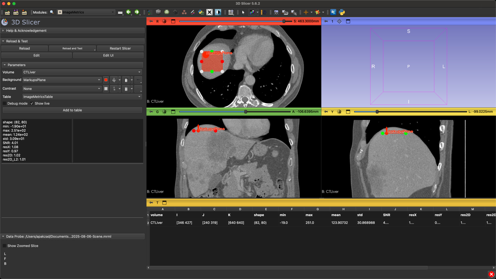

# SlicerImageMetrics
This is a [3D Slicer](https://www.slicer.org/) extension for measuring reference-less image quality metrics such as signal-to-noise ratio, contrast and resolution.

**Not yet available in the Slicer Extension Manager.**
**Status: Beta**

# Installation

1. Download/clone the repository.
2. Open Slicer and go to Edit > Application Settings > Modules > ">>".
3. Click the "Add" button and select the "ImageMetrics" folder.
4. Restart Slicer.
5. Open the module from the Slicer menu > Quantification > Image Metrics.

# Tutorial

1. Load a volume into Slicer. (Slicer sample data "CTLiver" recommended.)
2. Open the Slicer module menu > Quantification > Image Metrics.
3. Create an annotation plane on the input volume in a uniform area > 64 x 64.
4. Optional: Create a contrast plane on the input volume, across an interface between two tissues of interest.
5. Ensure the correct volume and planes are selected.
6. In "live mode", the results will be displayed inside the Slicer widget.
7. By clicking the "Apply" button, the results will be recorded to a table.
8. Multiple measurements can be made by repeating steps 3-7, which will be recorded to a new row in the table.
9. The table can be exported using Slicer's save function. (.csv etc.)

Further details can be found in the Help/Acknowledgements section of the module in Slicer.

# Developers

This module is written in Python and uses the [3D Slicer](https://www.slicer.org/) API.
Source code is available on [GitHub](https://github.com/ashkanpakzad/SlicerImageMetrics).
Testing is done using [Slicer Self Tests](https://slicer.readthedocs.io/en/latest/developer_guide/modules/selftests.html).

# License

This module is licensed under the Apache License 2.0. See [LICENSE](LICENSE) file for details.

# Acknowledgments

Enabled by funding from the National Health and Medical Research Council [2021/GNT2011204]
https://impact-mi.sydney.edu.au/ 